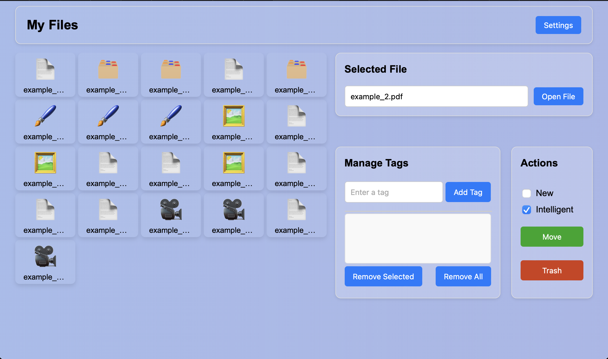

# **File Inbox Manager**

## Overview
The **File Inbox Manager** is a user-friendly application designed to help you organize files efficiently. By assigning tags to your files, the program automatically moves them to corresponding directories, making file management seamless and intuitive. Tags represent directories, and the application ensures your files are always stored in the right place.



### Example:
If you want to move a file to `../dir1/dir2/dir3`, it is sufficient to assign **`dir3`** as the tag. The program will automatically determine the correct path and move the file to the `dir3` directory.

## Features
- Assign custom tags to files for organized storage.
- Automatically move files to directories corresponding to their tags.
- Supports intelligent file handling and error checking.
- Trash unwanted files directly from the application.
- Cross-platform compatibility (Windows, macOS, Linux).

---

## Installation

To set up the **File Inbox Manager**, follow these steps:

1. **Clone the Repository:**
2. **Install Dependencies**: Use pip to install the required dependencies:
    ```bash
    pip install eel Send2Trash
    ```


## Running the Application

To set up the **File Inbox Manager**, follow these steps:

1. **Start the Program**: 
    ```bash
    python main.py
    ```
2. **Access the Interface**:
    - The application uses a web-based GUI powered by Eel.
    - Once started, the interface will appear in your default browser or a desktop window.

3. **Set Paths:** On your first execution, navigate to the settings to configure the inbox path (where your files are located) and the root path (the destination directory for organizing your files).

---
## Acknowledgments
This project utilizes the following tools and libraries:

- **[Eel](https://github.com/ChrisKnott/Eel)**: A Python library for creating simple Electron-like offline applications with HTML/JS frontends. It powers the web-based GUI for this project.
- **[Send2Trash](https://github.com/hsoft/send2trash)**: A Python library for sending files and folders to the operating system's trash/recycle bin, ensuring safe and reversible file deletions.
